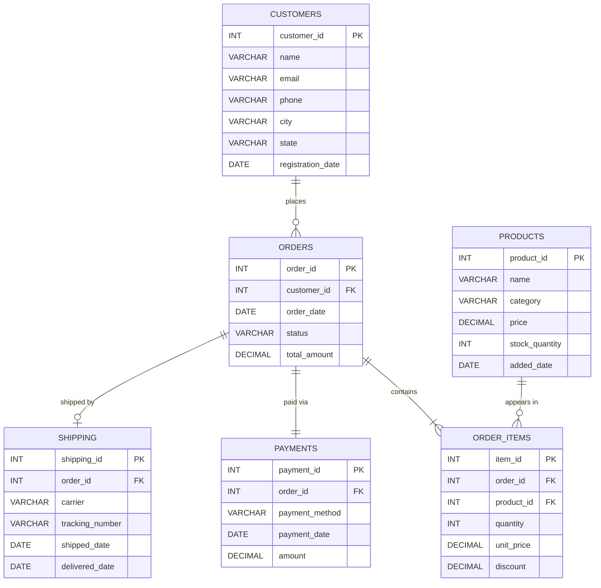

# E-Commerce Order Analytics System

## Problem Statement
You are hired as a Data Analyst at an online retail company. Management wants answers to:
- Why are sales declining in certain regions?
- Who are our most valuable customers?
- Which products are underperforming?
- What are the monthly revenue trends?

## Entity-Relationship (ER) Diagram



## How to Read the ER Diagram

| Symbol | Meaning |
|--------|---------|
| `\|\|--o{` | One-to-Many (one customer → many orders) |
| `\|\|--\|\|` | One-to-One (one order → one payment) |
| `PK` | Primary Key — uniquely identifies each row |
| `FK` | Foreign Key — links to another table's PK |

## Table Relationships Explained

1. **CUSTOMERS → ORDERS**: One customer can place many orders (1:N)
2. **ORDERS → ORDER_ITEMS**: One order can contain many items (1:N)
3. **PRODUCTS → ORDER_ITEMS**: One product can appear in many order items (1:N)
4. **ORDERS → PAYMENTS**: Each order has one payment record (1:1)
5. **ORDERS → SHIPPING**: Each order can have one shipping record (1:1, optional)

## Files in This Project

| File | What It Contains |
|------|-----------------|
| `schema.sql` | CREATE TABLE statements — run this FIRST |
| `seed_data.sql` | INSERT statements with realistic sample data — run SECOND |
| `queries.sql` | All business queries (Basic → Advanced) |
| `views_procedures.sql` | Views, Stored Procedures |

## How to Run (MySQL)

```sql
-- Step 1: Create the database
SOURCE schema.sql;

-- Step 2: Load sample data
SOURCE seed_data.sql;

-- Step 3: Run any query from queries.sql
```
